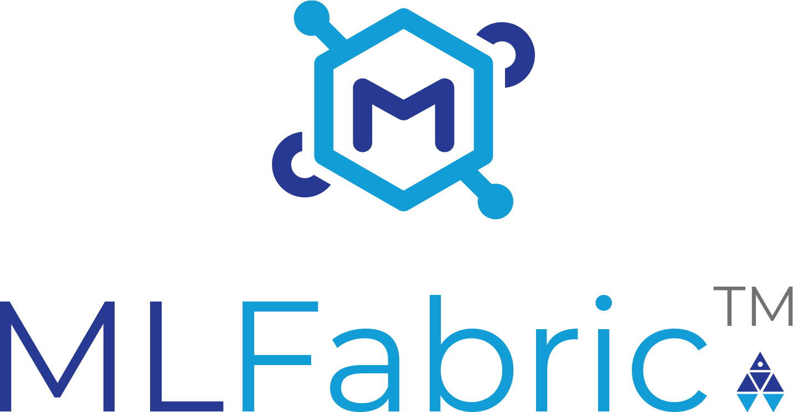
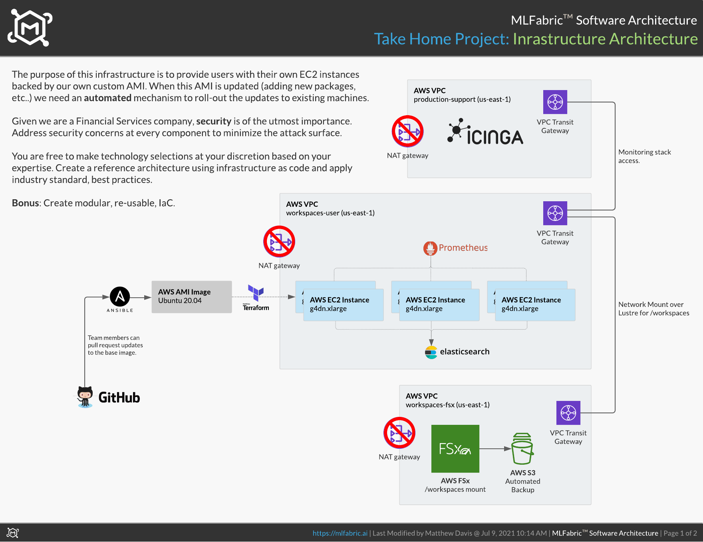
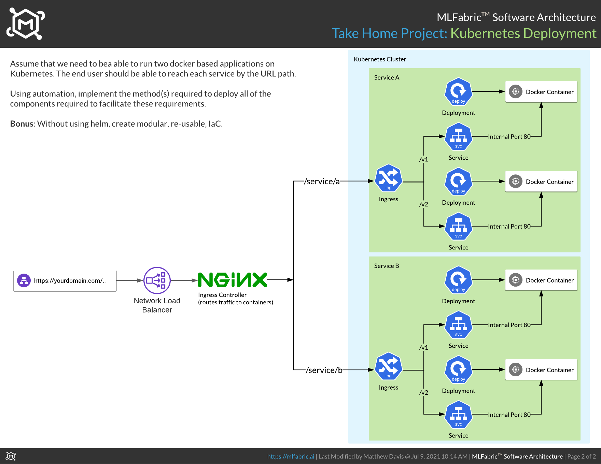

MLFabric is a model operationalization and productionization platform-as-a-service 
built by the Machine Learning Team at Moody's Analytics.

# Senior DevOps Engineer Job Description

We are in search of a self-motivated and versatile senior devops engineer with the ability to work in an energetic and interactive environment. You must be a self-starter with a passion for crafting innovative software solutions. You will regularly learn and implement new technologies, and play an active role in developing, proving out, and (re)assessment of existing architectures.

### ABOUT MOODY'S ANALYTICS MACHINE LEARNING TEAM

We are a team that creates and delivers machine learning models and applications for the financial services industry. At a high level, we ingest millions of news articles and other various data sources and process the data through pipelines to produce results such as entity recognition, sentiment analysis, credit adversity, and more.
Interested in machine learning? Take advantage of our growing team's collective knowledge and learn as you go. We fully embrace cross-training and continuous learning.

### JOB RESPONSIBILITIES

* Design and development of Terraform and Ansible modules.
* Deployment and productionization or machine learning model applications in production.
* Lead the team in various aspects around stability, application delivery, and availability .
* Contribute to the growth of the team and continuous learning.
* Maintain a strong security awareness through frequent assessments and software architecture design processes.
* Influence technology selection, software architecture design, security practices and implementation.

### JOB REQUIREMENTS

* Extensive experience in DevOps engineering, team management, and collaboration.
* Be ready, willing, and able to work in a fast-paced environment with a strong desire to run to trouble.
* Proficiency in shell scripting, python, and HCL.
* Knowledge and experience working with distributed systems.
* Extensive knowledge & experience with git, linux system administration, docker, kubernetes, and databases including elasticsearch and MySQL.
* Extensive knowledge of cloud platforms such as AWS, Azure, or Google Cloud.
* Strong communication and problem-solving skills with the ability to discuss projects with colleagues who have little technical knowledge of devops techniques and tools.
* Ability to oversee and provide significant valuable input regarding infrastructure design and maintenance.

---

# DevOps Interview Take Home Project

The purpose of this exercise is to demonstrate core competencies through Infrastructure-as-Code.

## Reference Architecture Implementations

### Infrastructure

The purpose of this infrastructure is to provide users with their own EC2 instances backed by our own custom AMI. When this AMI is updated (adding new packages, etc..) we need an automated mechanism to roll-out the updates to existing machines.

Given we are a Financial Services company, security is of the utmost importance. Address security concerns at every component to minimize the attack surface.

You are free to make technology selections at your discretion based on your expertise. Create a reference architecture using infrastructure as code and apply industry standard, best practices.

**Bonus**: Create modular, re-usable, IaC.

### Kubernetes

Assume that we need to bea able to run two docker based applications on Kubernetes. The end user should be able to reach each service by the URL path.

Using automation, implement the method(s) required to deploy all of the components required to facilitate these requirements.

**Bonus**: Without using helm, create modular, re-usable, IaC.

## Expectations

* Clean and well structured code.
* Re-usable and modular implementations.
* Single command to create and destroy the entire stack.
* Results to be distributed as a git repository.

## Contact

Matthew Davis (matthew.davis@moodys.com)

> “DevOps is not a Goal, But a never-ending process of continual improvement” – Jez Humble

---

Copyright © 2021 Moody's Analytics, Inc. All rights reserved.

